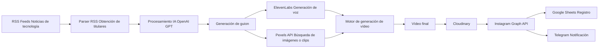

# 🤖 SynthSight AutoPosts Bot

Un bot inteligente desarrollado en **Python** que publica noticias de **tecnología e inteligencia artificial** en **Instagram** de forma automática.

El sistema obtiene noticias desde **fuentes RSS**, las analiza, genera un guion usando **IA**, produce un **vídeo narrado con voz clonada mediante ElevenLabs** y utiliza **imágenes o clips de Pexels** para crear contenido visual dinámico listo para publicar en redes sociales.

El objetivo es crear un **pipeline completamente automatizado de generación de contenido**: desde la obtención de la noticia hasta la publicación del vídeo final.

---

# 🚀 Características principales

- 🔄 **Automatización completa**  
  El bot obtiene, procesa y publica contenido sin intervención manual.

- 🧠 **Procesamiento con IA**  
  Analiza la noticia y genera un guion claro y atractivo utilizando modelos de lenguaje.

- 🎙 **Narración con voz clonada**  
  Utiliza **ElevenLabs** para generar audio con una voz clonada personalizada.

- 🎬 **Generación automática de vídeo**  
  Extrae imágenes y clips desde **Pexels** para generar un vídeo que acompaña la narración.

- ☁️ **Subida a Cloudinary**  
  El vídeo generado se sube automáticamente a **Cloudinary**, permitiendo que Instagram acceda al archivo mediante una URL pública.

- 📸 **Publicación automática**  
  Publica el vídeo generado directamente en **Instagram** mediante la **Meta Graph API**.

- 📊 **Registro de publicaciones**  
  Guarda el historial en **Google Sheets** para evitar duplicados y mantener control del contenido publicado.

- 📅 **Ejecución programada**  
  Utiliza **GitHub Actions** para ejecutar el bot automáticamente varias veces al día.

---

# 🧩 Tecnologías utilizadas

- **Python 3.12**
- **OpenAI API** — generación del guion y procesamiento del contenido
- **ElevenLabs API** — generación de audio con voz clonada
- **Pexels API** — obtención de imágenes y clips para el vídeo
- **Cloudinary API** — almacenamiento y distribución del vídeo
- **Meta Graph API** — publicación automática en Instagram
- **Google Sheets API + gspread** — registro y control de publicaciones
- **GitHub Actions** — automatización de tareas

---

# 🧩 Flujo de funcionamiento

1. El bot obtiene las noticias más recientes desde diferentes **Feeds RSS**.
2. Selecciona una noticia relevante y genera un **guion narrativo utilizando IA**.
3. Genera el **audio narrado con voz clonada mediante ElevenLabs**.
4. Obtiene **imágenes o vídeos relacionados desde Pexels**.
5. Genera automáticamente un **vídeo narrado combinando audio y contenido visual**.
6. Sube el vídeo final a **Cloudinary** para obtener una **URL pública accesible**.
7. Publica el vídeo en **Instagram** mediante la **API de Meta**.
8. Guarda la publicación en **Google Sheets** para evitar duplicados.
9. Envía una **notificación a Telegram** con el resultado del proceso.

---

# 🏗 Arquitectura del sistema

# 💡 Próximas mejoras

- 🎥 Publicación automática en **TikTok y YouTube Shorts**.
- 📊 Sistema de **analítica de engagement**.
- 🧍‍♂️ Generación de vídeos con **avatares IA presentando las noticias**.
- 🌐 Panel web para gestionar **fuentes RSS, horarios y estilo de contenido**.
- 🧠 Sistema de selección automática de noticias más virales.

---

# 🧑‍💻 Autor

**Pablo Vincenzo Vasta Triviño**  
Desarrollador Fullstack especializado en automatización y sistemas impulsados por IA  

🔗 LinkedIn  
https://www.linkedin.com/in/pablo-vincenzo-vasta-trivi%C3%B1o/
